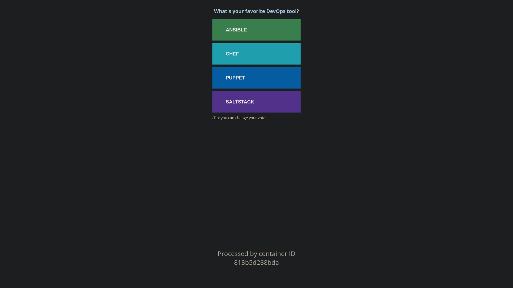

# POPEYE

## Table of Contents

1. [General Info](#general-info)
2. [Technologies](#technologies)
3. [Installation](#installation)
4. [Overview](#overview)

### General Info

***
The main objective of this project is to master the basics of containerizing applications and describing multicontainers infrastructures with Docker and Docker Compose.

***

## Technologies

A list of technologies used within the project:

* [Docker](https://www.docker.com/)
* [Docker Compose](https://docs.docker.com/compose/)

## Installation

***
A little intro about the installation.

```c
git clone git@github.com:Tom-Mendy/Popeye.git
cd Popeye
docker-compose up
```

## Overview

***

main page



after clicking on the page


